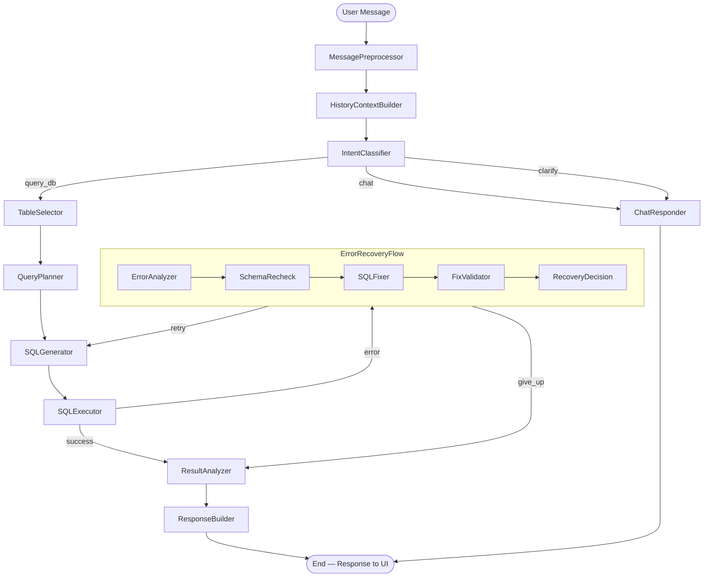

# Design Doc: NBA Basketball Chatbot

> Please DON'T remove notes for AI

## Requirements

> Notes for AI: Keep it simple and clear.
> If the requirements are abstract, write concrete user stories

### Project Overview

A conversational AI chatbot that lets users query the NBA basketball DuckDB database
(`projects/test-db/nba.duckdb`) using plain English. Built with PocketFlow and served
via a Gradio web interface. The LLM provider is OpenRouter (OpenAI-compatible API).

### Configuration (Environment Variables)

| Variable             | Purpose                              | Default                          |
| -------------------- | ------------------------------------ | -------------------------------- |
| `OPENROUTER_API_KEY` | API key for OpenRouter               | *(required)*                     |
| `OPENROUTER_MODEL`   | Model slug (user selects at runtime) | *(required — no hardcoded default)* |
| `DUCKDB_PATH`        | Path to `nba.duckdb`                 | `../../test-db/nba.duckdb`       |
| `DB_QUERY_TIMEOUT`   | Max seconds for a DuckDB query       | `30` (configurable)              |

> **Note**: Following PocketFlow best practices, env vars are read once at startup and placed
> into the shared store. All nodes and utilities access them from the shared store — no
> utility function reaches out to `os.environ` directly.

### User Stories

1. **Basic player query**: "Who scored the most points per game in the 2023-24 season?"
   → chatbot selects `dim_player` + `fact_player_game_stats`, generates SQL, returns a
   ranked table with a narrative summary.

2. **Follow-up / context carry**: "What about the previous season?"
   → chatbot carries forward the intent from chat history and adjusts the season filter.

3. **Team stats**: "Show me the Warriors' average net rating over the last 3 seasons."
   → chatbot joins `dim_team` + `fact_team_game_stats`, returns trend data.

4. **Play-by-play**: "How many clutch 3-pointers did LeBron hit this season?"
   → chatbot queries `fact_play_by_play`, filters by player, period, and clock time.

5. **Odds query**: "Which games this season had the biggest moneyline upsets?"
   → chatbot queries `fact_game` + `fact_game_main_line`, ranks by odds differential.

6. **Ambiguous input**: "Tell me about LeBron."
   → IntentClassifier returns `clarify`; ChatResponder asks the user to be more specific
   (career stats? recent game log? comparison to another player?).

7. **General NBA knowledge**: "What is the shot clock rule?"
   → IntentClassifier returns `chat`; ChatResponder answers from LLM knowledge, no DB
   query needed.

8. **Error recovery**: User asks for a stat that requires a complex join and the first SQL
   attempt fails → the error handling pipeline (ErrorAnalyzer → SchemaRecheck → SQLFixer
   → FixValidator → RecoveryDecision) retries up to 3 times before returning a graceful
   error message.

### Constraints

- **Read-only**: only `SELECT` statements are permitted; DDL/DML are rejected by
  `validate_sql_safety`.
- **Result cap**: queries return at most 200 rows (enforced by `optimize_sql`).
- **Query timeout**: DuckDB queries time out after `DB_QUERY_TIMEOUT` seconds (default 30).
  Enforced by the `execute_query` utility; expired queries return a graceful error in
  the response.
- **Database**: DuckDB only (`nba.duckdb` with 15 tables — 4 dimensions + 11 facts/views).
- **UI**: Gradio `gr.Blocks` web app with a chat panel and a collapsible SQL accordion
  showing the generated query for each answer.
- **LLM**: OpenRouter; model is user-configurable via `OPENROUTER_MODEL` env var.
- **Config access**: all configuration lives in the shared store. Utility functions receive
  config as parameters rather than reaching out to `os.environ` or global state.


## Flow Design

> Notes for AI:
> 1. Consider the design patterns of agent, map-reduce, rag, and workflow. Apply them if
>    they fit.
> 2. Present a concise, high-level description of the workflow.

### Applicable Design Patterns

1. **Agent** — `IntentClassifierNode` makes a routing decision each turn (`query_db` vs
   `chat` vs `clarify`), enabling dynamic branching.
2. **Workflow** — The query-DB path is a deterministic pipeline:
   pre-process → plan → generate SQL → validate → execute.
3. **Structured Output** — Every LLM call that produces SQL or a query plan uses
   `call_llm_structured` (YAML-wrapped output with field assertions), ensuring reliable
   parsing.
4. **Loop / Retry** — SQL errors trigger an error-handling sub-pipeline that loops back to
   SQL regeneration up to `max_debug_attempts` times.
5. **Nested Flow** — The error-handling sub-pipeline (ErrorAnalyzer → SchemaRecheck →
   SQLFixer → FixValidator → RecoveryDecision) is composed as a nested sub-Flow. This
   isolates error recovery logic, makes it independently testable, and aligns with
   PocketFlow's composition patterns. The parent flow wires the sub-Flow's "retry" and
   "give_up" actions to the appropriate nodes.

### Flow High-Level Design

**Per-turn pipeline (runs on every user message):**

1. **MessagePreprocessorNode** — Normalise raw input; extract named entities (players,
   teams, seasons).
2. **HistoryContextBuilderNode** — Compress recent chat history into a concise context
   block for downstream LLM prompts.
3. **IntentClassifierNode** — Route to `query_db`, `chat`, or `clarify`.
4. **TableSelectorNode** *(query_db path)* — Pick the relevant subset of the 15 DuckDB
   tables; call `format_schema` in `post()` to build `schema_context`.
5. **QueryPlannerNode** — Produce a high-level query plan (join strategy, filters,
   groupings) before SQL is written.
6. **SQLGeneratorNode** — Translate the plan + schema context into DuckDB-compatible SQL
   (YAML structured output); call `validate_sql_safety` + `optimize_sql` in `post()`.
7. **SQLExecutorNode** — Run the query via `execute_query`; branch to response pipeline
   on success or to error pipeline on failure.
8. **ErrorRecoveryFlow** *(nested sub-Flow, triggered by `"error"`)* — A composed sub-pipeline
   of 5 nodes that analyses the failure, re-checks the schema, generates a corrected SQL
   statement, validates it, and decides whether to retry or give up. The parent flow
   routes the sub-Flow's `"retry"` action back to `SQLGeneratorNode` and its `"give_up"`
   action to `ResultAnalyzerNode`. The sub-Flow's internal nodes are:
   - **ErrorAnalyzerNode** — Classify and deeply analyse the SQL error via LLM
   - **SchemaRecheckNode** — Re-fetch column details for entities named in the error
   - **SQLFixerNode** — Generate corrected SQL using full error context
   - **FixValidatorNode** — Gate: validate_sql_safety before allowing re-execution
    - **RecoveryDecisionNode** — Single decision point: increment attempt count, return
      `"retry"` (loop back to SQLGeneratorNode) or `"give_up"` (forward to
      ResultAnalyzerNode)
9. **ResultAnalyzerNode** — LLM interprets raw rows and generates an insight narrative
   (or a graceful error explanation on give_up).
10. **ResponseBuilderNode** — Call `format_results_table` + `format_response_markdown` to
    assemble the final markdown reply; append completed turn to `chat_history` in
    `post()`.
11. **ChatResponderNode** *(chat / clarify path)* — Answer from LLM general knowledge or
    ask for clarification; append turn to `chat_history` in `post()`.




## Utility Functions

> Notes for AI:
> 1. Understand the utility function definition thoroughly by reviewing the doc.
> 2. Include only the necessary utility functions, based on nodes in the flow.
> 3. Utilities are stateless functions — they do NOT access the shared store.
>    All shared store reads/writes happen in Node prep() and post() methods.

### LLM Utilities

> **PocketFlow best practice**: Utilities called from `exec()` should NOT use `try/except`.
> Let the Node's built-in retry mechanism (`max_retries`, `wait`) handle failures.
> Utilities should be pure functions that take all dependencies (API keys, model names,
> config) as explicit parameters — they do NOT read from `os.environ`, global state, or
> the shared store.

1. **Call LLM** (`utils/call_llm.py`)
   - *Input*: `prompt (str)`, `api_key (str)`, `model (str)`, `system_prompt (str = "")`
   - *Output*: `response (str)` — raw text from the model
   - *Used by*: ChatResponderNode, ResultAnalyzerNode, ErrorAnalyzerNode

2. **Call LLM Structured** (`utils/call_llm_structured.py`)
   - *Input*: `prompt (str)`, `api_key (str)`, `model (str)`, `required_fields (list[str])`,
     `system_prompt (str = "")`
   - *Output*: `parsed (dict)` — YAML-parsed response dict, validated for required fields
   - *Raises*: `ValueError` if required fields are missing (triggers Node retry)
   - *Used by*: MessagePreprocessorNode, IntentClassifierNode, TableSelectorNode,
     QueryPlannerNode, SQLGeneratorNode, SQLFixerNode

### Schema Utilities

3. **Get Full Schema** (`utils/get_full_schema.py`)
   - *Input*: `db_path (str)`
   - *Output*: `schema_by_table (dict)` — `{table_name: {"columns": [{"name", "type"}],
     "row_count": int}}`
   - *Used by*: called once at server startup; result stored in `shared["schema_by_table"]`

4. **Get Schema Subset** (`utils/get_schema_subset.py`)
   - *Input*: `schema_by_table (dict)`, `table_names (list[str])`
   - *Output*: `subset (dict)` — filtered view of `schema_by_table`
   - *Used by*: SchemaRecheckNode to narrow schema to problematic entities

5. **Format Schema** (`utils/format_schema.py`)
   - *Input*: `schema_subset (dict)`
   - *Output*: `formatted (str)` — human-readable schema string for LLM prompts, e.g.:
     ```
     TABLE dim_player (person_id BIGINT, first_name VARCHAR, last_name VARCHAR, ...)
     TABLE fact_player_game_stats (game_id VARCHAR, person_id BIGINT, points INTEGER, ...)
     ```
   - *Used by*: TableSelectorNode (`post()`), SchemaRecheckNode (`post()`)

### SQL Utilities

6. **Execute Query** (`utils/execute_query.py`)
   - *Input*: `db_path (str)`, `sql (str)`, `max_rows (int = 200)`, `timeout_seconds (int =
     30)`
   - *Output*: `result (dict)` — `{"success": bool, "columns": list[str], "rows":
     list[list], "elapsed_ms": float, "error": str | None}`
   - *Timeout handling*: If the query exceeds `timeout_seconds`, the utility returns
     `success=False` with a descriptive timeout error. No `try/except` inside the utility —
     DuckDB's native timeout mechanism is used.
   - *Used by*: SQLExecutorNode

7. **Validate SQL Safety** (`utils/validate_sql_safety.py`)
   - *Input*: `sql (str)`
   - *Output*: `(is_safe: bool, reason: str)` — `True` if SQL is a read-only SELECT;
     `False` with reason if it contains DDL (`CREATE`, `DROP`, `ALTER`), DML (`INSERT`,
     `UPDATE`, `DELETE`), or is not a SELECT statement
   - *Used by*: SQLGeneratorNode (`post()`), FixValidatorNode (`exec()`)

8. **Optimize SQL** (`utils/optimize_sql.py`)
   - *Input*: `sql (str)`, `default_limit (int = 200)`
   - *Output*: `optimized_sql (str)` — SQL with `LIMIT` injected if absent; `SELECT *`
     replaced with explicit column list where deterministic
   - *Used by*: SQLGeneratorNode (`post()`)

9. **Classify Error** (`utils/classify_error.py`)
   - *Input*: `error_message (str)`
   - *Output*: `error_type (str)` — one of `"syntax_error"`, `"missing_column"`,
     `"missing_table"`, `"type_mismatch"`, `"permission"`, `"unknown"` — determined by
     regex pattern matching (no LLM call)
   - *Used by*: ErrorAnalyzerNode (`prep()`)

### Result Formatting Utilities

10. **Format Results Table** (`utils/format_results_table.py`)
    - *Input*: `columns (list[str])`, `rows (list[list])`, `max_display (int = 50)`
    - *Output*: `table_md (str)` — GitHub-flavoured markdown table; if `len(rows) >
      max_display`, appends `> Showing 50 of N rows.`
    - *Used by*: ResponseBuilderNode

11. **Format Response Markdown** (`utils/format_response_markdown.py`)
    - *Input*: `narrative (str)`, `table_md (str)`, `sql (str)`, `elapsed_ms (float)`
    - *Output*: `response_md (str)` — full Gradio-rendered markdown with narrative,
      results table, and a collapsible `<details>` SQL accordion showing the query and
      execution time
    - *Used by*: ResponseBuilderNode


## Node Design

### Shared Store

> Notes for AI: Try to minimize data redundancy

```python
shared = {
    # ── Static (set once at startup, never modified per-turn) ─────────────────
    "db_path": str,  # Absolute path to nba.duckdb
    "schema_by_table": dict,  # {table_name: {"columns": [...], "row_count": int}}
    "openrouter_api_key": str,  # From OPENROUTER_API_KEY env var
    "openrouter_model": str,  # From OPENROUTER_MODEL env var
    "db_query_timeout": int,  # From DB_QUERY_TIMEOUT env var (default 30)
    "max_rows": int,  # Max result rows (default 200)
    # ── Per-turn: raw input ───────────────────────────────────────────────────
    "user_message": str,  # Raw user message from Gradio
    # ── Per-turn: pre-processing ──────────────────────────────────────────────
    "clean_message": str,  # Normalised message (trimmed, lowercased entities resolved)
    "entities": dict,  # {"players": [...], "teams": [...], "seasons": [...]}
    "history_context": str,  # Compressed context block from recent chat history
    # ── Per-turn: routing ─────────────────────────────────────────────────────
    "intent": str,  # "query_db" | "chat" | "clarify"
    # ── Per-turn: schema / planning ───────────────────────────────────────────
    "selected_tables": list,  # Table names chosen by TableSelectorNode
    "schema_context": str,  # Formatted schema string for selected tables only
    "query_plan": str,  # High-level plan from QueryPlannerNode
    # ── Per-turn: SQL generation ──────────────────────────────────────────────
    "generated_sql": str,  # Validated + optimised SQL (ready to execute)
    # ── Per-turn: execution ───────────────────────────────────────────────────
    "sql_result": dict,  # {"columns": [...], "rows": [...], "elapsed_ms": float}
    "execution_error": str,  # Last DuckDB error message (or None)
    "debug_attempts": int,  # Current iteration of the error-handling loop
    "max_debug_attempts": int,  # Maximum retries before give_up (default: 3)
    # ── Per-turn: error handling ──────────────────────────────────────────────
    "error_type": str,  # Output of classify_error()
    "error_analysis": str,  # LLM's explanation of why the query failed
    "schema_recheck": str,  # Re-fetched schema for problematic entities
    "fixed_sql": str,  # Candidate corrected SQL from SQLFixerNode
    "recovery_action": str,  # "retry" or "give_up" — set by RecoveryDecisionNode
    # ── Per-turn: response ────────────────────────────────────────────────────
    "result_analysis": str,  # LLM narrative / insight from ResultAnalyzerNode
    "response": str,  # Final markdown sent to Gradio UI
    "response_sql": str,  # SQL displayed in the UI accordion (may be fixed_sql)
    # ── Multi-turn state ──────────────────────────────────────────────────────
    "chat_history": list,
    # Each entry: {"role": "user"|"assistant", "content": str,
    #              "sql": str|None, "error": bool}
}
```

### Node Steps

> Notes for AI: Carefully decide whether to use Batch/Async Node/Flow.
> All nodes below are Regular (synchronous) unless noted.

---

#### Pre-processing Stage

1. **MessagePreprocessorNode**
   - *Purpose*: Normalise raw user input and extract named entities so downstream nodes
     receive clean, structured data rather than raw freeform text.
   - *Type*: Regular (`max_retries=2`)
   - *Steps*:
      - *prep*: Read `user_message`, `openrouter_api_key`, `openrouter_model` from shared
        store
      - *exec*: Call `call_llm_structured` with required fields `["clean_message",
        "entities"]`; prompt asks the model to trim/resolve the message and extract
        `players`, `teams`, and `seasons` as lists
      - *post*: Write `clean_message` and `entities` to shared store

2. **HistoryContextBuilderNode**
   - *Purpose*: Produce a compact, token-efficient context summary of the last N turns so
     every downstream LLM prompt has relevant conversational context without ballooning in
     size.
    - *Type*: Regular (`max_retries=0` — deterministic string formatting, no retry needed)
    - *Steps*:
      - *prep*: Read `chat_history` (last 6 entries) from shared store
      - *exec*: Format the last 6 turns into a concise `[User: "..." / SQL: (top scorers
        query) / Assistant: "..."]` block. When a turn has associated SQL, include a
        truncated summary (e.g. first 80 chars or the main intent) rather than the full
        SQL to keep the context block token-efficient. Pure string formatting — no LLM
        call is made in this node.
      - *post*: Write `history_context` to shared store

3. **IntentClassifierNode**
   - *Purpose*: Route each message to the correct sub-pipeline, preventing unnecessary DB
     queries for general knowledge questions.
   - *Type*: Regular (`max_retries=2`)
   - *Steps*:
      - *prep*: Read `clean_message`, `history_context`, `openrouter_api_key`,
        `openrouter_model` from shared store
      - *exec*: Call `call_llm_structured` with required fields `["intent", "reason"]`;
        prompt asks model to classify as `query_db` (needs the NBA database), `chat`
        (general NBA knowledge), or `clarify` (ambiguous — needs more info); assert
        `intent in {"query_db", "chat", "clarify"}`
      - *post*: Write `intent` to shared store; initialise `debug_attempts=0` and
        `max_debug_attempts=3`; return action string `intent`

---

#### Schema / Planning Stage (`query_db` path)

4. **TableSelectorNode**
   - *Purpose*: Restrict the schema context to only the tables relevant to the current
     question, keeping LLM prompts concise and reducing hallucinated column names.
   - *Type*: Regular (`max_retries=2`)
   - *Steps*:
      - *prep*: Read `clean_message`, `entities`, `history_context`,
        `openrouter_api_key`, `openrouter_model`; build a compact table-name +
        column-names listing from `shared["schema_by_table"]`
      - *exec*: Call `call_llm_structured` with required fields `["tables", "reason"]`;
        prompt lists all 15 table names with brief descriptions; model returns the subset
        needed; assert all returned names exist in `schema_by_table`
      - *post*: Write `selected_tables`; call `get_schema_subset` then `format_schema` and
        write result to `schema_context`

5. **QueryPlannerNode**
   - *Purpose*: Produce a human-readable query plan before SQL is written, so
     `SQLGeneratorNode` has clear join/filter guidance rather than having to infer
     everything from the question alone.
   - *Type*: Regular (`max_retries=2`)
   - *Steps*:
      - *prep*: Read `clean_message`, `entities`, `schema_context`, `history_context`,
        `openrouter_api_key`, `openrouter_model`
      - *exec*: Call `call_llm_structured` with required fields `["plan", "tables_used",
        "filters", "aggregations"]`; prompt asks for a step-by-step English description of
        how to answer the question using the available schema
      - *post*: Write `query_plan` to shared store

6. **SQLGeneratorNode**
   - *Purpose*: Translate the query plan and schema context into a valid, safe,
     DuckDB-compatible SQL statement.
   - *Type*: Regular (`max_retries=3`, `wait=2`)
   - *Steps*:
      - *prep*: Read `clean_message`, `schema_context`, `query_plan`, `history_context`,
        `openrouter_api_key`, `openrouter_model`; also read `execution_error`,
        `error_type`, `error_analysis`, `schema_recheck` (all `None` on the first pass;
        populated on retry path)
      - *exec*: Call `call_llm_structured` with required fields `["thinking", "sql"]`;
        prompt emphasises DuckDB syntax (not SQLite); when error-context fields are
        populated (retry path), the prompt includes the previous error, its root cause,
        and the re-checked schema so the regenerated SQL corrects the failure; assert
        output `sql` starts with `SELECT` (case-insensitive); return the `sql` string
      - *exec_fallback*: Return `"SELECT 'SQL generation failed after retries' AS error"`
        — a safe no-op SELECT that triggers a graceful error in ResultAnalyzerNode rather
        than crashing the flow
       - *post*: Call `validate_sql_safety(sql)` — raise `ValueError` on failure (triggers
         retry); call `optimize_sql(sql)` and write result to `generated_sql`; reset
         `execution_error` to `None`

> **Design note**: This node serves dual purpose — it generates the initial SQL on the
> first pass and regenerates corrected SQL on the retry path. The `prep()` includes
> error-context fields (all `None` on the first pass, populated on retry) so the prompt
> adapts conditionally. This trades a simpler node count for more complex `prep()` logic
> vs. the reference cookbook's separate `GenerateSQL` + `DebugSQL` nodes.

---

#### Execution Stage
7. **SQLExecutorNode**
   - *Purpose*: Run the generated SQL against DuckDB and branch the flow based on
     success or failure.
   - *Type*: Regular
   - *Steps*:
      - *prep*: Read `db_path`, `generated_sql`, `db_query_timeout`, `max_rows` from
        shared store
      - *exec*: Call `execute_query(db_path, generated_sql, max_rows=max_rows,
        timeout_seconds=db_query_timeout)`; return the result dict (contains `success`,
        `columns`, `rows`, `elapsed_ms`, `error`)
      - *post*: If `success`: write `sql_result`; write `response_sql = generated_sql`;
        return `"success"`. If not `success`: write `execution_error`; return `"error"`.
        (Attempt-count check and give-up decision are handled in
        `RecoveryDecisionNode`.)

---

#### Error Handling Stage (nested sub-Flow, triggered by `"error"`)

The 5 error-recovery nodes below are composed into a single `ErrorRecoveryFlow` (a
PocketFlow `Flow` object used as a Node). Internally the nodes are chained linearly:
```python
error_analyzer >> schema_recheck >> sql_fixer >> fix_validator >> recovery_decision
error_recovery_flow = ErrorRecoveryFlow(start=error_analyzer)
```
The parent flow wires it as:
```python
sql_executor - "error" >> error_recovery_flow
error_recovery_flow - "retry" >> sql_generator
error_recovery_flow - "give_up" >> result_analyzer
```

> **Important**: `ErrorRecoveryFlow` must subclass `Flow` and override `post()` to read
> `shared["recovery_action"]` (set by `RecoveryDecisionNode.exec()`) and return it to the
> parent flow. See the Implementation Notes for the full mechanism.

8. **ErrorAnalyzerNode**
   - *Purpose*: Classify and deeply analyse the SQL error before attempting a fix,
     providing targeted context that improves fix quality.
    - *Type*: Regular (`max_retries=2`)
    - *Steps*:
       - *prep*: Read `execution_error`, `generated_sql`, `clean_message`, `schema_context`,
         `openrouter_api_key`, `openrouter_model` from shared store; call
         `classify_error(execution_error)` and store result in local variable
       - *exec*: Call `call_llm_structured` with required fields `["error_type",
         "root_cause", "affected_entities", "suggested_fix_direction"]`; prompt includes
         the classified error type, the failed SQL, the original question, and the schema
         context
       - *post*: Write `error_type` and `error_analysis` to shared store

9. **SchemaRecheckNode**
   - *Purpose*: Re-fetch the exact schema (column names, types) for the specific tables or
     columns named in the error, giving `SQLFixerNode` precise correction targets.
   - *Type*: Regular
   - *Steps*:
      - *prep*: Read `error_analysis`, `schema_by_table`; parse `affected_entities` from
        error analysis to determine which tables to re-fetch
      - *exec*: Call `get_schema_subset(schema_by_table, affected_tables)`; call
        `format_schema(subset)`; return formatted string
      - *post*: Write `schema_recheck` to shared store

10. **SQLFixerNode**
    - *Purpose*: Generate a corrected SQL statement using all available error context —
      the original question, the classified error, the LLM's root-cause analysis, and the
      re-checked schema.
    - *Type*: Regular (`max_retries=2`)
    - *Steps*:
      - *prep*: Read `clean_message`, `generated_sql`, `error_type`, `error_analysis`,
        `schema_recheck`, `query_plan`, `openrouter_api_key`, `openrouter_model`
      - *exec*: Call `call_llm_structured` with required fields `["thinking", "sql"]`;
        prompt presents the failed SQL + full error context + rechecked schema and asks
        for a corrected DuckDB query; assert output `sql` starts with `SELECT`; return
        `sql`
      - *post*: Write `fixed_sql` to shared store

11. **FixValidatorNode**
    - *Purpose*: Prevent a bad fix from entering the execution loop — acts as a
      lightweight gate that catches obvious safety and structure violations before another
      DB round-trip.
    - *Type*: Regular (`max_retries=0` — safety validation is deterministic; failure here
      should propagate to `RecoveryDecisionNode`, not retry internally)
    - *Steps*:
      - *prep*: Read `fixed_sql` from shared store
      - *exec*: Call `validate_sql_safety(fixed_sql)`; if not safe, raise `ValueError`
        (triggers Node retry / surfaces to RecoveryDecision); return `(is_safe, reason)`
      - *post*: If safe: overwrite `generated_sql` with `fixed_sql` (so SQLExecutorNode
        picks it up on retry); return `"default"`

12. **RecoveryDecisionNode**
    - *Purpose*: This is the single decision point for retry vs. give-up. Evaluates the
      attempt count and error state and writes the decision to the shared store so the
      sub-Flow's custom `post()` can relay it to the parent flow.
    - *Type*: Regular
    - *Steps*:
       - *prep*: Read `debug_attempts`, `max_debug_attempts`, `error_type` from shared
         store; increment `debug_attempts`
       - *exec*: Pure Python logic — if `debug_attempts < max_debug_attempts` and
         `error_type != "permission"` return `"retry"`; else return `"give_up"`
       - *post*: Write `"recovery_action"` to shared store (set to the `exec` return
         value); return `"default"` (ends sub-Flow — the parent flow sees
         `ErrorRecoveryFlow.post()`, not this return)

---

#### Response Stage

13. **ResultAnalyzerNode**
    - *Purpose*: Translate raw query results (or a failure state) into a human-readable
      insight narrative tailored to the basketball domain.
    - *Type*: Regular (`max_retries=2`)
    - *Steps*:
      - *prep*: Read `clean_message`, `sql_result` (may be `None` on give_up),
        `execution_error`, `debug_attempts`, `max_debug_attempts`, `history_context`,
        `openrouter_api_key`, `openrouter_model`
      - *exec*: Call `call_llm` (free-form); if `sql_result` has rows, prompt asks model
        to narrate findings with basketball context; if give_up path (`sql_result` is
        `None`), prompt asks for a user-friendly explanation of why the query could not be
        completed; return narrative string
      - *exec_fallback*: Return `"I wasn't able to analyze the results. Please try
        rephrasing your question."` so the user always gets a graceful response
      - *post*: Write `result_analysis` to shared store

14. **ResponseBuilderNode**
    - *Purpose*: Assemble the final user-facing markdown response and update conversation
      history — single source of truth for everything the Gradio UI renders.
    - *Type*: Regular
    - *Steps*:
      - *prep*: Read `result_analysis`, `sql_result`, `response_sql`, `debug_attempts`,
        `max_debug_attempts`
      - *exec*: Call `format_results_table(columns, rows)` if `sql_result` is not `None`
        and has rows; call `format_response_markdown(narrative, table_md, sql,
        elapsed_ms)`; return completed markdown string
      - *post*: Write `response` to shared store; append `{"role": "assistant", "content":
         response, "sql": response_sql, "error": sql_result is None}` to
         `chat_history`

---

#### Chat Stage (`chat` / `clarify` path)

15. **ChatResponderNode**
    - *Purpose*: Answer general NBA knowledge questions or request clarification — no DB
      access, no SQL generation.
    - *Type*: Regular (`max_retries=2`)
    - *Steps*:
      - *prep*: Read `clean_message`, `intent`, `history_context`,
        `openrouter_api_key`, `openrouter_model` from shared store
      - *exec*: Call `call_llm` with a system prompt establishing the model as an NBA
        expert assistant; if `intent == "clarify"`, prompt instructs the model to ask a
        targeted follow-up question; return response string
      - *exec_fallback*: Return `"I'm sorry, I couldn't process that request. Could you
        try again?"` — a safe fallback reply
      - *post*: Write `response` to shared store; append `{"role": "assistant", "content":
        response, "sql": None, "error": False}` to `chat_history`

### Implementation Notes

- **`exec_fallback`**: The following nodes implement `exec_fallback` to provide graceful
  degradation when all retries are exhausted — they return safe fallback responses rather
  than propagating exceptions:
  - `SQLGeneratorNode` — returns a safe no-op `SELECT` so the flow continues
  - `ResultAnalyzerNode` — returns a user-friendly error message
  - `ChatResponderNode` — returns a generic apology message
  Internal debugging nodes (`ErrorAnalyzerNode`, `SQLFixerNode`) intentionally do **not**
  implement `exec_fallback` — they let exceptions propagate. These nodes are wrapped inside
  `ErrorRecoveryFlow` which has its own retry budget, and their failures surface naturally
  as `give_up` decisions rather than crashes.

- **Utilities and exception handling**: Following PocketFlow best practices, utility
  functions do **not** use `try/except`. All failure handling lives in the Node layer via
  `max_retries`, `wait`, and `exec_fallback`.

- **Config as parameters**: All environment variables are read once at `app.py` startup and
  placed into the shared store (`openrouter_api_key`, `openrouter_model`,
  `db_query_timeout`, `db_path`). Node `prep()` methods read these from shared and pass
  them as explicit parameters to utility functions. No utility reaches out to `os.environ`.

- **Nested Flow wiring**: `ErrorRecoveryFlow` is created as `Flow(start=error_analyzer)`
  with internal nodes chained linearly. The parent flow wires it as a Node via
  `sql_executor - "error" >> error_recovery_flow`.

  **Critical — how nested Flow action bubbling works in PocketFlow**: When a sub-Flow's
  internal node returns an action that has no successor wiring within the sub-Flow, the
  sub-Flow stops executing its internal nodes and calls its own `post()` method. The
  parent flow then sees whatever `ErrorRecoveryFlow.post()` returns — **not** what
  `RecoveryDecisionNode.post()` returns. Therefore `ErrorRecoveryFlow` must override
  `post()` to read the decision from the shared store and relay it to the parent:

  ```python
  class ErrorRecoveryFlow(Flow):
      def post(self, shared, prep_res, exec_res):
          return shared.get("recovery_action", "give_up")
  ```

  The parent flow wires these actions:
  ```python
  sql_executor - "error" >> error_recovery_flow
  error_recovery_flow - "retry" >> sql_generator
  error_recovery_flow - "give_up" >> result_analyzer
  ```

- **Database read-only connection**: The DuckDB connection used by `execute_query` should
  be opened with `read_only=True` as an additional safety layer beneath `validate_sql_safety`.

- **Prompt files**: All system prompts live as `.txt` files in `prompts/` rather than
  inline strings. Each node's `exec()` reads its prompt file at runtime. This keeps node
  code clean and makes prompt iteration fast (no code changes needed).

- **Gradio per-message handler**: Creates a new flow run per user message:
  1. Append user message to `shared["chat_history"]`
  2. Set `shared["user_message"]`
  3. Call `flow.run(shared)` — the flow reads/writes shared, returns after completion
  4. Read `shared["response"]` and yield it to the Gradio chat panel
  5. The SQL accordion is rendered from the `<details>` block inside `response` (built
     by `format_response_markdown`), so no separate Gradio component is needed


## Gradio UI (`app.py`)

The web interface uses `gr.Blocks` with:
- **Chat panel**: standard message/response display driven by `shared["response"]`
- **SQL accordion**: a `gr.Accordion` (collapsed by default) beneath each assistant
  response showing the generated SQL and execution time — populated from
  `shared["response_sql"]` via `format_response_markdown`
- **Startup**: reads all env vars (`OPENROUTER_API_KEY`, `OPENROUTER_MODEL`,
  `DUCKDB_PATH`, `DB_QUERY_TIMEOUT`) and places them into `shared`. Then calls
  `get_full_schema(db_path)` and stores the result in `shared["schema_by_table"]`.
  The same `shared` dict is passed (and mutated) on every message turn.
- **Per-message handler**: sets `shared["user_message"]` from the Gradio text input,
  appends the user message to `shared["chat_history"]`, calls `flow.run(shared)`,
  and returns `shared["response"]` as the assistant's reply.


## File Structure

```
projects/pocketflow-chatbot/
├── app.py                          # Gradio web UI entry point
├── main.py                         # CLI entry point (keep for testing)
├── flow.py                         # Flow wiring — all 15 nodes + branches
├── nodes.py                        # All 15 Node class definitions
├── utils/
│   ├── __init__.py                  # Package marker; exports key utilities
│   ├── call_llm.py                 # Raw OpenRouter LLM call
│   ├── call_llm_structured.py      # YAML-parsed structured LLM call with validation
│   ├── get_full_schema.py          # Extract all 15 tables at startup
│   ├── get_schema_subset.py        # Filter schema to specific table names
│   ├── format_schema.py            # Format schema dict → LLM-readable string
│   ├── execute_query.py            # Run DuckDB SQL, return columns/rows/elapsed/error
│   ├── validate_sql_safety.py      # SELECT-only gate (no DDL/DML)
│   ├── optimize_sql.py             # Inject LIMIT, rewrite SELECT *
│   ├── classify_error.py           # Regex-based DuckDB error type classification
│   ├── format_results_table.py     # rows + columns → markdown table with truncation
│   └── format_response_markdown.py # Assemble narrative + table + SQL accordion
├── prompts/
│   ├── preprocess_prompt.txt       # MessagePreprocessorNode system prompt
│   ├── intent_classifier_prompt.txt # IntentClassifierNode system prompt
│   ├── table_selector_prompt.txt    # TableSelectorNode system prompt
│   ├── query_planner_prompt.txt     # QueryPlannerNode system prompt
│   ├── sql_generator_prompt.txt     # SQLGeneratorNode system prompt
│   ├── error_analyzer_prompt.txt    # ErrorAnalyzerNode system prompt
│   ├── sql_fixer_prompt.txt         # SQLFixerNode system prompt
│   ├── result_analyzer_prompt.txt   # ResultAnalyzerNode system prompt
│   └── chat_responder_prompt.txt    # ChatResponderNode system prompt
├── docs/
│   └── design.md                   # This document
└── requirements.txt                # pocketflow, duckdb, gradio, openai, pyyaml
```
